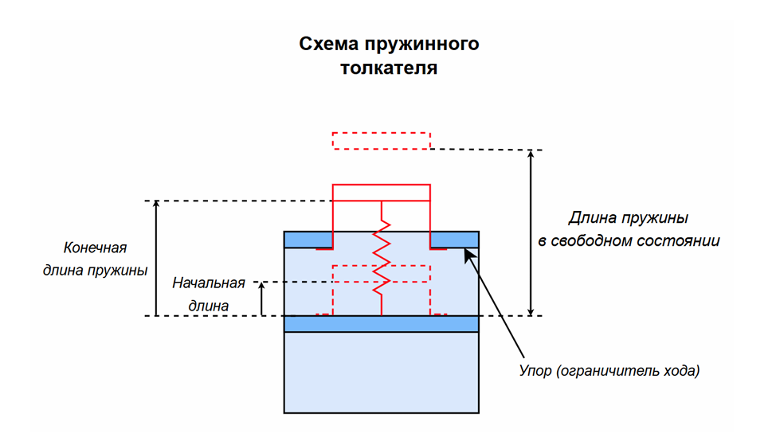
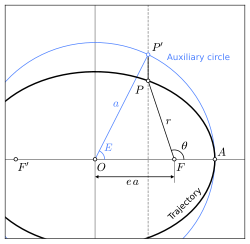
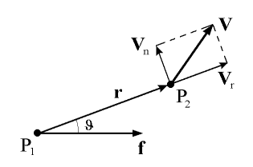

# Описание логики решения задачи моделирования отделения КА от ступени РН

## 1. Общая постановка задачи

В рамках тестового задания рассматривается задача моделирования процесса отделения
космического аппарата (КА) от ступени ракеты-носителя (РН) с использованием толкателя
(пружинного механизма).

Целью является численное вычисление движения КА и ступени РН после момента начала
отделения с учётом:
- центрального гравитационного поля Земли;
- силового воздействия толкателя в течение ограниченного времени;
- реальных масс объектов и геометрических параметров толкателя.

Результатом решения являются:
- временные зависимости положений и скоростей КА и РН в инерциальной системе координат;
- относительное расстояние и относительная скорость;
- временной закон силы толкателя;
- графическая визуализация движения.

---

## 2. Физическая модель

### 2.1. Основные допущения

В рамках модели приняты следующие допущения:

1. КА и ступень РН рассматриваются как материальные точки.
2. Единственной внешней силой является центральное гравитационное поле Земли.
3. Взаимодействие между КА и РН в процессе отделения осуществляется только через толкатель.
4. Толкатель действует вдоль фиксированной оси, совпадающей с направлением начальной
   орбитальной скорости.
5. Атмосферное сопротивление, несферичность гравитационного поля и вращение Земли
   не учитываются.


---

### 2.2. Система координат

Все вычисления выполняются в инерциальной системе координат ECI (Earth-Centered Inertial),
соответствующей эпохе J2000.

Дополнительно для анализа могут использоваться:
- относительная система координат КА относительно РН;
- система координат центра масс системы КА–РН.

---

### 2.3. Уравнения движения

Пусть:
- $\mathbf{r}_{LV}, \mathbf{v}_{LV}$ — радиус-вектор и скорость ступени РН;
- $\mathbf{r}_{SC}, \mathbf{v}_{SC}$ — радиус-вектор и скорость КА;
- $m_{LV}, m_{SC}$ — массы РН и КА;
- $\mu $— гравитационный параметр Земли.

#### Гравитационное ускорение

Для каждого тела ускорение от гравитации задаётся выражением:


$$\mathbf{a}_g(\mathbf{r}) = -\mu \frac{\mathbf{r}}{\|\mathbf{r}\|^3}$$


#### Модель толкателя

Модель толкателя представлена на рисунке ниже.



*Рисунок 1 — схема пружинного толкателя.*

Ось толкателя задаётся единичным вектором:

$$\mathbf{u} = \frac{\mathbf{v}_0}{\|\mathbf{v}_0\|}$$


Текущая длина толкателя:

$$L = (\mathbf{r}_{SC} - \mathbf{r}_{LV}) \cdot \mathbf{u}$$


Закон силы толкателя:

$$F =
\begin{cases}
k (L_{free} - L), & L < L_{free} \ \text{и} \ L < L_{end}, \\
0, & \text{иначе}.
\end{cases}$$


Сила прикладывается:
- к КА: $+F \mathbf{u}$,
- к РН: $-F \mathbf{u}$,

что обеспечивает выполнение третьего закона Ньютона.


---

### 2.4. Вектор состояния

Полный вектор состояния системы имеет вид:


$\mathbf{x} =
\begin{bmatrix}
\mathbf{r}_{LV} \\
\mathbf{v}_{LV} \\
\mathbf{r}_{SC} \\
\mathbf{v}_{SC}
\end{bmatrix}
\in \mathbb{R}^{12}$


Соответствующая система дифференциальных уравнений первого порядка интегрируется
численно.

### 2.5. Полная система ОДУ (в ECI)

Уравнения первого порядка:


$$\dot{\mathbf{r}}_{LV} = \mathbf{v}_{LV}$$

$$\dot{\mathbf{v}}_{LV} = -\mu \frac{\mathbf{r}_{LV}}{\|\mathbf{r}_{LV}\|^3} \;+\; \frac{\mathbf{F}_{LV}}{m_{LV}}
= -\mu \frac{\mathbf{r}_{LV}}{\|\mathbf{r}_{LV}\|^3} \;-\; \frac{F}{m_{LV}}\mathbf{u}$$


$$\dot{\mathbf{r}}_{SC} = \mathbf{v}_{SC}$$


$$\dot{\mathbf{v}}_{SC} = -\mu \frac{\mathbf{r}_{SC}}{\|\mathbf{r}_{SC}\|^3} \;+\; \frac{\mathbf{F}_{SC}}{m_{SC}}
= -\mu \frac{\mathbf{r}_{SC}}{\|\mathbf{r}_{SC}\|^3} \;+\; \frac{F}{m_{SC}}\mathbf{u}$$


где $m_{LV}$, $m_{SC}$ — массы РН и КА (кг).

---

### 2.6. Производные (выходные) величины

В процессе моделирования вычисляются:

- относительное расстояние:

$$d(t) = \|\mathbf{r}_{SC}(t) - \mathbf{r}_{LV}(t)\|, \quad [d]=\text{м}$$


- относительная скорость:

$$v_{rel}(t) = \|\mathbf{v}_{SC}(t) - \mathbf{v}_{LV}(t)\|, \quad [v_{rel}]=\text{м/с}$$


- сила толкателя $F(t)$, Н;
- (диагностически) длина толкателя $L(t)$, м.

Эти величины используются для построения графиков и формирования CSV-отчёта.

---

## 3. Начальные условия

Начальные условия формируются на основе кеплеровых элементов орбиты в момент начала
отделения.

Геометрический смысл кеплеровых элементов иллюстрируется на рисунке ниже.


*Рисунок 2 — Геометрическая интерпретация кеплеровых элементов орбиты в инерциальной
системе координат.*

### 3.1. Решение уравнения Кеплера

Средняя аномалия ```M``` связана с эксцентрической аномалией ```E``` уравнением Кеплера:


$$M = E - e \sin E$$


Уравнение решается методом Ньютона, который выбран благодаря:
- квадратичной сходимости;
- устойчивости при малых и умеренных эксцентриситетах;
- простоте реализации и контроля точности.

Геометрический смысл эксцентрической аномалии E показан на следующем рисунке.



*Рисунок 3 — Геометрическое определение эксцентрической аномалии \(E\) для эллиптической
орбиты.*

---

### 3.2. Переход от кеплеровых элементов к векторам \(r, v\)

После нахождения эксцентрической аномалии вычисляются:
- радиус-вектор и скорость в орбитальной системе координат PQW;
- затем выполняется поворот в ECI с помощью композиции ортогональных матриц вращения.


В процессе перехода используются следующие системы координат:

1. **Орбитальная система координат PQW**
2. **Инерциальная система координат ECI (J2000)**

#### 3.2.1 Орбитальная система координат PQW

Орбитальная система координат **PQW** определяется следующим образом:

- ось $P$ направлена вдоль линии апсид в сторону перицентра;
- ось $Q$ лежит в плоскости орбиты и дополняет систему до правой;
- ось $W$ направлена вдоль вектора орбитального момента импульса.

Система **PQW** связана с орбитой и вращается вместе с ней.

---

#### 3.2.2 Инерциальная система координат ECI (J2000)

Система координат **ECI** (Earth-Centered Inertial) является инерциальной системой,
связанной с центром масс Земли и неподвижной относительно звёзд.
Именно в этой системе координат производится численное интегрирование уравнений движения.

---


#### 3.2.3 Положение и скорость в системе PQW

Пусть:
- $a$ — большая полуось,
- $e$ — эксцентриситет,
- $\mu$ — гравитационный параметр центрального тела.

#### 3.2.4 Радиус-вектор

Расстояние до центрального тела:


$$r = a (1 - e \cos E)$$


Компоненты радиус-вектора в системе **PQW**:


$$\mathbf{r}_{PQW} =
\begin{bmatrix}
a (\cos E - e) \\
a \sqrt{1 - e^2} \sin E \\
0
\end{bmatrix}$$


---

#### 3.2.5 Вектор скорости

Вектор скорости раскладывается на радиальную компоненту $V_r$, направленную вдоль радиус-вектора $r$, и поперечную (трансверсальную) компоненту $V_n$, направленную по нормали к радиус-вектору

Далее представлен рисунок, иллюстирующий разложение скорости:



*Рисунок 4 — Геометрическое изображение разложения скорости, здесь $ \theta $ - истиная аномалия.*

Компоненты скорости выражаются через истиную аномалию следующим образом:

$$V_r=\frac{\sqrt{\mu}}{p} e \sin \nu$$
$$V_n=\frac{\sqrt{\mu}}{p} (1 + e \cos \nu)$$

Тогда вектор скорости выражается в виде композиции:

$$v=V_r\mathbf{r}+V_n \mathbf{ \theta} $$

где:

$$\mathbf{r} = \begin{bmatrix}
\cos \nu \\
\sin \nu \\
0
\end{bmatrix}; 

\quad

\mathbf{\theta} =\begin{bmatrix}
-\sin \nu \\
\cos \nu \\
0
\end{bmatrix}$$

Вектор скорости в системе **PQW** имеет вид:


$$\mathbf{v}_{PQW} =
\frac{\sqrt{\mu}}{p}
\begin{bmatrix}
- \sin \nu \\
e + \cos \nu \\
0
\end{bmatrix}$$


или в выражении через эксцентрическую аномалию $E$:


$$\mathbf{v}_{PQW} =
\frac{\sqrt{\mu a}}{r}
\begin{bmatrix}
- \sin E \\
\sqrt{1 - e^2} \cos E \\
0
\end{bmatrix}$$

---

#### 3.2.6 Переход из системы PQW в ECI

Переход от орбитальной системы координат **PQW** к инерциальной системе **ECI**
осуществляется с помощью последовательности ортогональных вращений:

1. Поворот на угол $\omega$ (аргумент перицентра) вокруг оси $W$;
2. Поворот на угол $i$ (наклонение) вокруг линии узлов;
3. Поворот на угол $\Omega$ (долгота восходящего узла) вокруг оси $Z$ системы **ECI**.

Итоговая матрица перехода имеет вид:


$$\mathbf{Q}_{PQW \to ECI}
=
\mathbf{R}_3(\Omega)\,
\mathbf{R}_1(i)\,
\mathbf{R}_3(\omega)$$


где:
- $\mathbf{R}_1(\cdot)$ — матрица вращения вокруг оси \(X\),
- $\mathbf{R}_3(\cdot)$ — матрица вращения вокруг оси \(Z\).

---

#### 3.2.7. Векторы положения и скорости в ECI

Окончательные выражения для векторов положения и скорости в инерциальной системе координат:


$$\mathbf{r}_{ECI} = \mathbf{Q}_{PQW \to ECI}\, \mathbf{r}_{PQW}$$


$$\mathbf{v}_{ECI} = \mathbf{Q}_{PQW \to ECI}\, \mathbf{v}_{PQW}$$


Полученные векторы $\mathbf{r}_{ECI}$ и $\mathbf{v}_{ECI}$ используются
в качестве начальных условий для численного интегрирования уравнений движения.

---


## 4. Численные методы

### 4.1. Метод интегрирования

Для интегрирования системы ОДУ используется метод `ode45` (явный метод Рунге–Кутты
4–5 порядка с адаптивным шагом).

Выбор обусловлен:
- хорошей точностью при умеренной жёсткости задачи;
- устойчивостью для задач орбитальной механики;
- доступностью в GNU Octave без дополнительных пакетов.

Выходные значения решения формируются на равномерной сетке времени с шагом
$\Delta t = 0.01$ с.

---

### 4.2. Контроль корректности

Для валидации численного решения используются следующие проверки:
- невязка уравнения Кеплера;
- сохранение энергии и момента импульса в двухтельной задаче (при отключённом толкателе);
- сохранение полного импульса системы при отсутствии гравитации.

---

## 5. Последовательность решения задачи

Общая логика решения реализована следующим образом:

1. Задание исходных параметров задачи.
2. Решение уравнения Кеплера и вычисление начальных условий.
3. Формирование вектора начального состояния.
4. Численное интегрирование уравнений движения.
5. Постобработка результатов:
   - вычисление относительных величин;
   - экспорт данных в CSV;
   - построение графиков.
6. Выполнение тестов корректности.

---

## 6. Структура программной реализации

### 6.1. Основные файлы

- `run.m` — основной сценарий, задающий параметры и запускающий расчёт.
- `simulate_sep.m` — численное интегрирование и вычисление производных величин.
- `rhs_sep.m` — правая часть системы дифференциальных уравнений.
- `spring_force.m` — вычисление силы толкателя.
- `kepler_E.m` — решение уравнения Кеплера методом Ньютона.
- `kepler2rv.m` — переход от кеплеровых элементов к векторам состояния.
- `rotmat.m` — матрицы элементарных вращений.
- `postprocess.m` — построение и сохранение графиков.
- `export_csv.m` — экспорт результатов в CSV-файл.

---

### 6.2. Документирование функций

Каждая функция снабжена комментариями, в которых:
- описана физическая сущность входных и выходных параметров;
- указаны единицы измерения;
- пояснены нетривиальные участки алгоритмов.

Комментарии не дублируют очевидные операции и сосредоточены на физическом и
математическом смысле вычислений.

---

## 7. Визуализация результатов

В процессе постобработки формируются графики:

- траектории КА и РН в инерциальной системе координат;
- относительная траектория КА относительно РН;
- движение в системе центра масс;
- временные зависимости относственного расстояния, скорости и силы толкателя;
- компоненты векторов положения и скорости.

---


## 8. Заключение

Реализованная модель позволяет адекватно описать динамику процесса отделения КА от
ступени РН на начальном участке движения. Структура программной реализации обеспечивает
наглядность, расширяемость и удобство верификации результатов.
